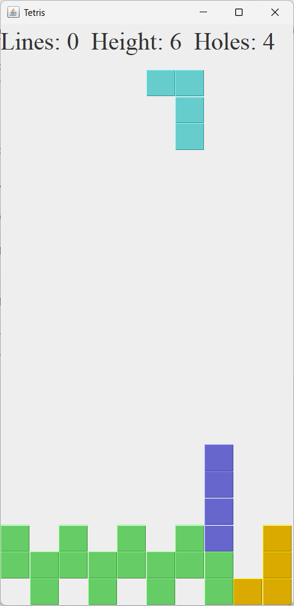

# JavaTetris4RL

This is a Java Tetris game server that can be used for reinforcment learining. The server [TetrisMTServer.java](java_tetris_server/src/main/java/org/aiotlab/TetrisMTServer.java) is multi-threaded and each thread has its own Tetris game. The Python client can connect to the server, create and control a Tetris game with ASCII commands, and receive status and screenshots from the server. [TetrisClientTest.ipynb](python_notebooks/TetrisClientTest.ipynb) demonstrates how to control the server with Python socket. You can also play the game by running [TetrisPlayer.java](java_tetris_server/src/main/java/org/aiotlab/TetrisPlayer.java) as shown below. The Tetris game is adapted from [ZetCode](https://zetcode.com/javagames/tetris/).

## Communication Protocol

We use a request-response pattern. The client sends command to the server first. The server runs the command and responds with new game status and screenshots.

### Client -> Server

The client command format is a keyword + ' ' + parameters.The main commands are listed below:

| Command            | Description                                                      |
|--------------------|------------------------------------------------------------------|
| start              | Reset and start the game                                         |
| move X             | Move current piece X steps horizontally. Ex: -1: left, 1:right   |
| rotate CW          | CW=0: counter-clockwise (CCW); CW=1: clockwise (CW)              |
| drop               | Drop current piece                                               |

### Client <- Server

The server response data are binary (1 + 4 + img_size + PNG screenshot). Note that the screenshot (100 * 200) is compressed in PNG format and vary in size. Therefore, we need to send the image size first. The binary packet format is:

| Bytes |  1    |    4         |  4     |   4   |    4       | Variable length |
|-------|-------|--------------|--------|-------|------------|------------|
| Field |IsOver | Removed Lines| Height | Holes | Image Size | PNG file   |

The detailed description of each field is listed below:

| Bytes    | Format  | Description             |
|----------|---------|-------------------------|
| 1        | Boolean | Is game over            |
| 4        | Integer | Number of lines removed |
| 4        | Integer | Height of the blocks    |
| 4        | Integer | Empty holes in the blocks|
| 4        | Integer | Screenshot image size   |
| Variable | PNG     | Compressed screenshot (100 * 200)   |
